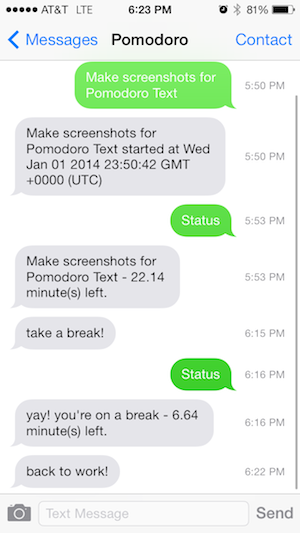
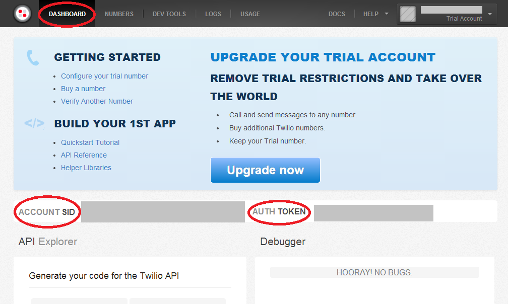
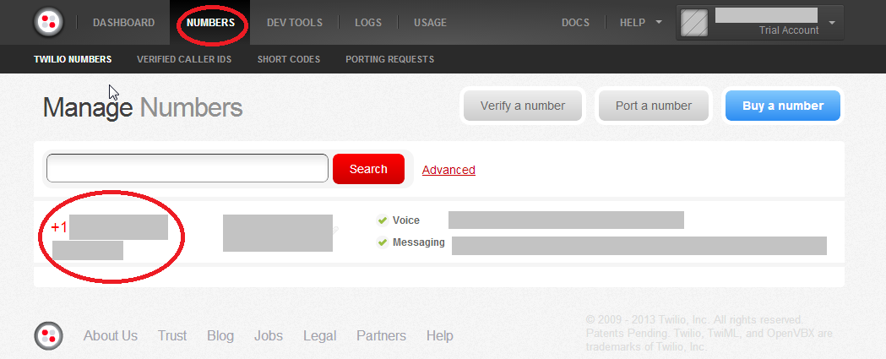
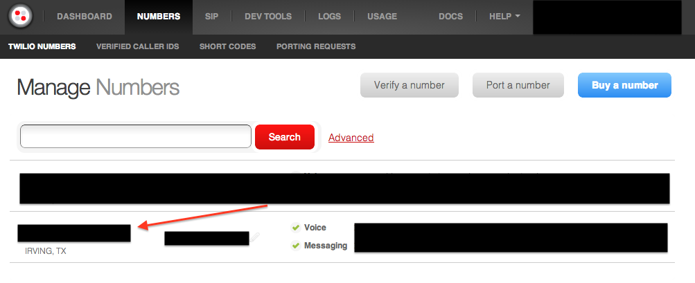
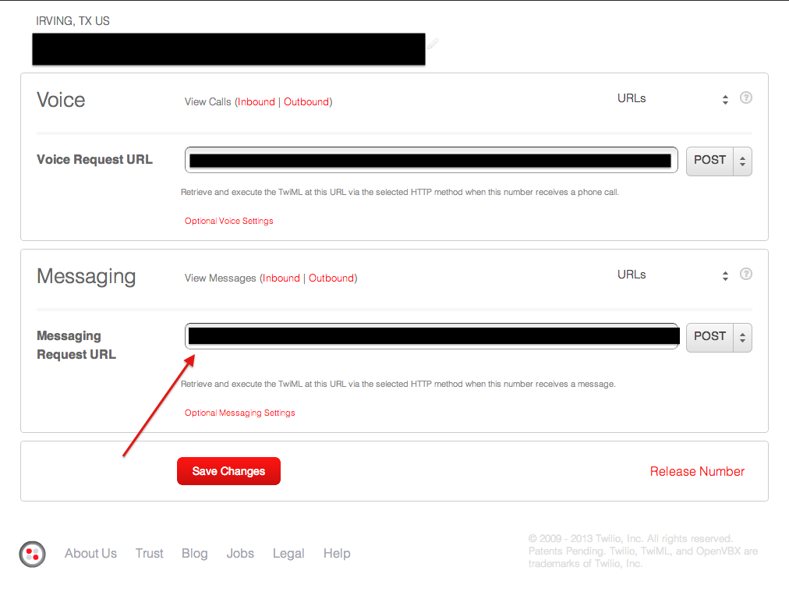

## Pomodoro Text - A Pomodoro client with a NodeJS backing and a text messaging interface.

>The Pomodoro Technique is a time management method developed by Francesco Cirillo in the late 1980s. The technique uses a timer to break down work into intervals traditionally 25 minutes in length, separated by short breaks. These intervals are known as "pomodori", from the Italian word pomodoro for "tomato". The method is based on the idea that frequent breaks can improve mental agility.

Tech: NodeJS, AngularJS, ExpressJS, Twillo, Redis

License: MIT

## It's for developers

This app isn't deployed anywhere for use by the public. It is meant to be deployed **by you, the developer**. Pomodoro Text is a single user application that you can deploy to the **NodeJS** provider of your choice (I've included instructions for deploying to Heroku). **You own the code and the data. Extend this app as you see fit. Make your own twitter mashups. Publish your code for others to learn, fork, extend and deploy**.

## What Pomodoro Text Does 

After you have deployed Pomodoro Text, you can send a text message the Twilio account associated with your deployment:

- Sending the word `status` will let you know how much time you have left in your current pomodoro session or break.
- Sending the word `break` will start a break. You'll be notified 7 minutes later via text to get back to work.
- Sending any other phrase will start a 25 minute pomodoro session. You'll be notified 25 minutes later via text to take a break. And then will be notified 7 minutes after that to get back to work (at which point you can send another phrase to start the pomodoro session).

Here is an example text conversation you can have with Pomodoro Text:

- `status`: "no pomodoro's currently running"
- `need to create readme`: "need to create readme started at Tue Dec 31 2013 21:54:18 GMT+0000 UTC"
- `status`: "need to create readme started - 25 minute(s) left"
- work for 25 minutes....
- you'll get a text: "take a break!"
- `status`: "yay! you're on a break - 7 minute(s) left"
- browse the internet for 7 minutes
- you'll get a text: "back to work!"
- `status`: "no pomodoro's currently running"
- `take care of bills`: "take care of bills at ..." 
- `clear` or ` ` cancels the current action, whether it's a break or a task
- any pre-mature changes in a task will change the end time (logging it as an interruption)

So you could have a conversation like this:

Hopefully you get the idea. Features in the pipeline:

- History of all the tasks that you've attempted.
- Ability to record when you've been interrupted.
- Graphs and stuff.

## Instructions for deploying your own Pomodoro Text

Go to http://nodejs.org and install NodeJS

Go to http://redis.io/download and install Redis. Or use Chocolatey (Windows), Brew (Mac), apt-get flavor for your Linux distro.

Then clone this repo:

    git clone https://github.com/amirrajan/pomodoro-text.git

And `cd` into the directory (all instructions below assume you are in the `pomodoro-text` directory:

    cd pomodoro-text

## Run Locally

### Register a free account with Twilio

Sign up with a free Twilio account: https://www.twilio.com/try-twilio

Create a `.env` file locally at `pomodoro-text` root:

<pre>
password=YourPasswordForTwoPhaseAuthorization
mobile=+15555555 ;your mobile number
twilioAssignedPhoneNumber=+15555555 ;your twilio assigned mobile number
twilioAccountSid=xxxxxxxxxxxxxxxxxxxxxxxxxxxxxxxxxx ;twilio account sid (see screenshots)
twilioAuthToken=xxxxxxxxxxxxxxxxxxxxxxxxxxxxxxxx ;twilio auth token (see screeshots)
enableAuth=false
deployUrl=http://localhost:3000
supressTextMessages=false
</pre>

Values are located here and here:

Using a command prompt where `node` is available, run the following command to install all Pomodoro Text dependencies:

    npm install (you may need to prefix this with sudo if you're on Mac/Linux)

At this point you'll should be able to run the app locally by running the following command:

    grunt

To view the app, go to `http://localhost:3000`

After the app is running, you need to expose the site publically so that Twilio can forward text messages to you. Run local tunnel using the following command:

    lt --port 3000

You'll be given a url when `lt` runs. Update the `Messaging Request URL` to be the url provided by local tunnel _plus_ `/text`. For example, if local tunnel gave you `https://xknteuaexs.localtunnel.me`, then the value you need to place in Twilio is `https://xknteuaexs.localtunnel.me/text`.

Click the number you want to edit:

Update the Messaging Request Url

At this point, you should be able to send a text to the Twilio number, and you should receive a reply stating that your pomodoro has started.

If you do not wish to expose your locally running instance to Twilio (or can't because of network restrictions), you can still start and stop pomodoros using the web interface (as if it were your phone, just send the same text messages you would have done through your phone and click the submit button). You will still get text messages notifying you about your sessions.

If you want to dispable text messages all together, set `supressTextMessages` to `true` in `.env`:

    supressTextMessages=true

### Running the app "in the cloud" 

### Securing the app with a two-phase auth

Given that this app is hard wired to your Twilio account, it's best that you run the app with `enableAuth` set to `true`. With authorization enabled, you'll need to provide a password and an authorization code to access the site. If you get the password correct, a text message will be sent (via Twilio) to a mobile device you've specified.

##Signing up and running Pomodoro Text on Heroku

From heroku.com, click Documentation, then click the Getting Started button, then click Node.js from the list of options on the left...which will take you here: https://devcenter.heroku.com/articles/nodejs 

Install Heroku toolbelt from here: https://toolbelt.heroku.com/

Sign up via the website (no credit card required).

Login using the command line tool:

    heroku login

Create your heroku app:

    heroku create YOURAPPNAME

Add redis to your app

    heroku addons:add redistogo:nano

Git deploy your app:

    git push heroku master

Assign a dyno to your app:

    heroku ps:scale web=1

Set environment variables on the server:

    heroku config:set password=YourPasswordForTwoPhaseAuthorization
    heroku config:set mobile=+15555555
    heroku config:set twilioAssignedPhoneNumber=+15555555
    heroku config:set twilioAccountSid=xxxxxxxxxxxxxxxxxxxxxxxxxxxxxxxxxx
    heroku config:set twilioAuthToken=xxxxxxxxxxxxxxxxxxxxxxxxxxxxxxxx
    heroku config:set enableAuth=true
    heroku config:set deployUrl=http://YOURAPPNAME.herokuapp.com
    heroku config:set supressTextMessages=false

Open the app (same as opening it in the browser):

    heroku open

And your app should be up on Heroku.

Once your app is deployed, you'll need to repoint the Twilio `Messaging Request URL` to be the url of your Heroku deployment _plus_ `/text`. For example, if local tunnel gave you `https://my-awesome-pomodoro.herokuapp.com`, then the value you need to place in Twilio is `https://my-awesome-pomodoro.herokuapp.com/text`.
